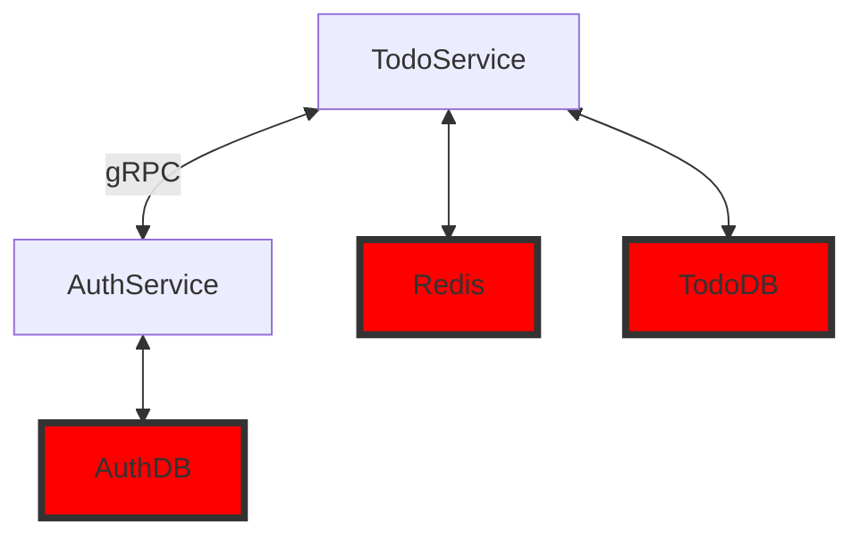

## Запуск сервисов

### Настройка
Настройка приложения осуществляется через переменные среды. 
Для удобства начальной настройки вы можете скопировать содержимое файла `.env-example` в файл `.env`, который будет использоваться при запуске приложения.

### База данных и миграции

Используемая CLI для миграций - [goose](https://github.com/pressly/goose).

**Команда для миграций:**
```bash
cd migrate && goose postgres "user=postgres password=postgres port=5432 host=localhost dbname=url_shorter sslmode=disable" up
```

**Подключение к бд через консоль:**
```bash
> docker exec -it postgres psql -U postgres
```

### Запуск с использованием Docker Compose

После настройки переменных среды в файле `.env`, вы можете запустить все необходимые сервисы с помощью Docker Compose. 
```bash
docker-compose up -d
```
После этого все микросервисы должны быть запущены.

Вы можете проверить статус запущенных контейнеров с помощью команды:
```bash
docker-compose ps
```

## Архитектура



## Описание сервисов

### TodoService

Микросервис, предназначенный для работы с задачами, использует AuthService для авторизации.

## Тесты

Основной функционал покрыт unit-тестами, для запуска необходимо написать
```bash
make test
```
---

**Планируемый функционал**

- REST API эндпоинты для задач, списков задач
- Отдельный микросервис для авторизации при помощи JWT(способ общения - gRPC)
- Метрики Prometheus
- Docker окружение
- CI/CD
- Покрытие тестами
- Кэширование Redis
- OpenAPI

**Планируемые метрики Prometheus**
- Счётчик созданных задач
- Счётчик удалённых задач
- Счётчик завершённых задач

- Счётчик успешных и неудачных попыток аутентификации(`auth_attempts_total`) и неудачные
- Количество хитов и промахов кэша (`cache_hits_total`, `cache_misses_total`)

- HTTP метрики