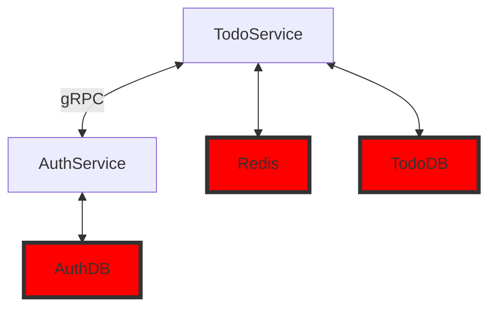

## Запуск сервисов

### Настройка
Настройка приложения осуществляется через переменные среды. 
Для удобства начальной настройки вы можете скопировать содержимое файла `.env-example` в файл `.env`, который будет использоваться при запуске приложения.

### База данных и миграции

Используемая CLI для миграций - [goose](https://github.com/pressly/goose).

**Команда для миграций:**
```bash
cd migrate && goose postgres "user=postgres password=postgres port=5432 host=localhost dbname=url_shorter sslmode=disable" up
```

**Подключение к бд через консоль:**
```bash
> docker exec -it postgres psql -U postgres
```

### Запуск с использованием Docker Compose

После настройки переменных среды в файле `.env`, вы можете запустить все необходимые сервисы с помощью Docker Compose. 
```bash
docker-compose up -d
```
После этого все микросервисы должны быть запущены.

Вы можете проверить статус запущенных контейнеров с помощью команды:
```bash
docker-compose ps
```

## Архитектура



## Описание сервисов

### TodoService

Микросервис, предназначенный для работы с задачами, использует AuthService для авторизации.

#### **REST API**


##### Авторизация
1. **Регистрация**
```
/register
```

- **POST:** Регистрирует нового пользователя

Тело запроса:
```
{
    "login": "login",
    "password": "password"
}
```


2. **Логин:**
```
/login
```

- **POST:** Получение токена

Тело запроса:
```
{
    "login": "login",
    "password": "password"
}
```

В ответ возвращает токен в виде хедера `Authorization`.
```
Все запросы ниже требует jwt-токен в хедере.
```

##### Задачи
```
/task
```

- **POST:** Создание задачи

Тело запроса:
```
{
    "title": string,  - название задачи
    "body": string, - описание задачи 
    "is_done":bool, - выполнена ли задача 
}
```

```
/task/{task-id}

(Доступ имеет только создатель задачи)
```

- **DELETE** Удалить задачу 

- **PUT** Обновить задачу

-- **GET** Получить задачу

Тело ответа:
```
{
    "id": int, - ID задачи
    "title": string,  - название задачи
    "body": string, - описание задачи 
    "is_done":bool, - выполнена ли задача 
    "owner": string - login создателя
}
```

##### Список задач

```
/task-list
```

- **POST** Создать список задач

Тело запроса(пример):
```
{
  "id": 1,
  "owner": "someowner",
  "tasks": [
    {
      "body": "Задача 1",
      "is_done": false
      ...
    }
    ...
  ]
}
```

```
/task-list/{list-id}

```

- **DELETE** Удалить список задач

- **PUT** Обновить список задач

- **GET** Получить список задач


---
## Тесты

Основной функционал покрыт unit-тестами, для запуска необходимо написать
```bash
make test
```
---

